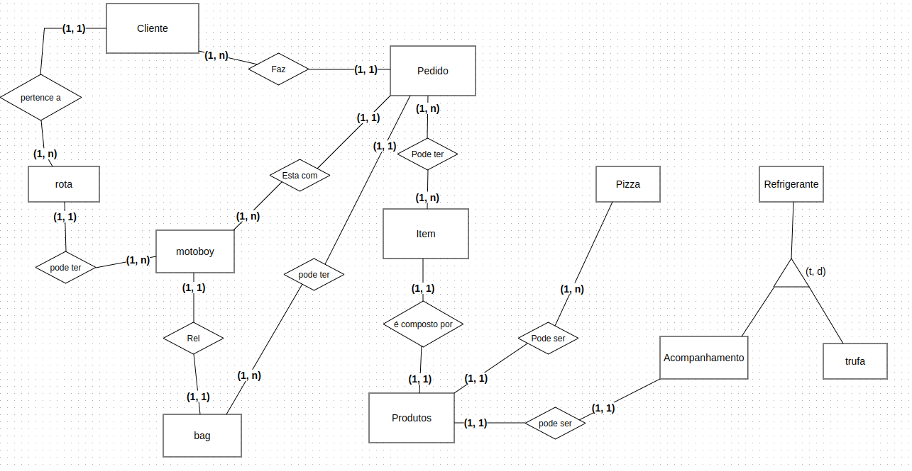
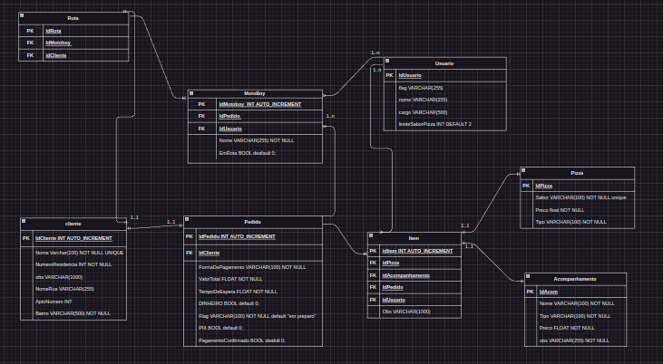

<h1>Gerenciador de Pedidos para uma pizzaria</h1>
<h3>

Eu mesmo levantei os requisitos, as regras de negócio e a modelagem dos dados, com o levantamento das funcionalidades que fiz
é possível ver esse arquivo (nada bonito) em: "ComoDeveFuncionar.txt"

</h3>
<h2>Requisitos funcionais:</h2>
<ul>
    <li>Cadastrar usuário admin</li>
    <li>Cadastrar produtos no sistema (pizzas e acompanhamento)</li>
    <li>Criar um pedido</li>
    <li>Cancelar a criação de um pedido (caso cliente desista da compra durante o cadastro do pedido)</li>
    <li>Buscar endereço do cliente por API de GPS</li>
    <li>Adicionar informações adicionais a um pedido (remover cebola, por exemplo)</li>
    <li>Cadastrar até 5 pizzas e 4 acompanhamentos para um pedido, caso maior calcular duas rotas de entrega</li>
    <li>Gerar comanda com o pedido</li>
    <li>Exibir todos os pedidos</li>
    <li>Cancelar um pedido</li>
    <li>Editar um pedido</li>
    <li>Confirmar que o pedido foi entregue</li>
    <li>Confirmar que o pedido está em rota de entrega</li>
    <li>Exibir informações detalhadas dos pedidos</li>
    <li>Listar pedidos de acordo com um filtro (flags)</li>
    <li>Se pagamento = pix -> Confirmar pagamento do pedido</li>
    <li>Informar que o pedido está pronto (Aguardando motoboy)</li>
    <li>Criar uma rota de acordo com os pedidos que estão com um motoboy</li>
    <li>Cadastrar um motoboy</li>
    <li>Finalizar pedido</li>
</ul>

<h2>Regras de negócio</h2>
<ul>
    <li>Produtos cadastrados devem possuir valor, nome e tipo.</li>
    <li>Acompanhamentos podem ser n coisas</li>
    <li>Todo produto cadastrado no sistema deve ter um identificador único</li>
    <li>Criar regra de limite de sabores para uma única pizza</li>
    <li>Todo pedido deve ter:
        <ol>
            <li>Nome do cliente</li>
            <li>Identificador do pedido</li>
            <li>Produtos pedidos</li>
            <li>Valor total</li>
            <li>Tempo de espera</li>
            <li>Forma de pagamento</li>
            <li>Se pagamento em dinheiro -> valor a voltar ao cliente se houver troco</li>
            <li>Flag -> começa com "em preparo"</li>
            <li>Se pix -> pagamento confirmado? Zerar o campo de troco</li>
            <li>Pedido agrupado?</li>
            <li>Se pedido agrupado: identificador do pedido deve ser: 1a e 1b (IdentificadorA e IdentificadorB)</li>
        </ol>
    </li>
    <li>Buscar endereço do cliente por API de GPS</li>
    <li>Comandas devem ter as informações do pedido e o número do identificador relativamente grande.</li>
    <li>Informações adicionais somente para a remoção de elementos; para adicionar elementos, o valor e o elemento devem ser feitos manualmente</li>
    <li>Se o pedido exceder 5 pizzas ou 4 refrigerantes (capacidade que um motoqueiro consegue levar), botão de "criar pedido agrupado" deve surgir, onde:
        <ol>
            <li>Duas comandas separadas devem ser impressas</li>
            <li>Um identificador gigante no topo da comanda deve mostrar "PEDIDO AGRUPADO" e o número do identificador do pedido</li>
            <li>A segunda comanda deve conter as mesmas informações acima, mas com o seu próprio identificador</li>
        </ol>
    </li>
    <li>Pedidos serão exibidos em uma página onde:
        <ol>
            <li>Os pedidos com a flag "em andamento" vão estar no topo</li>
            <li>Pedidos são listados por ordem de chegada (primeiro a ser pedido, primeiro a ser preparado)</li>
            <li>Terá opções de filtro por flags</li>
            <li>Opção de pesquisa por pedidos</li>
        </ol>
    </li>
    <li>
        
Pedidos listados na página de "exibir pedidos" devem ter os botões:

        <ol>
            <li>Pedido pronto</li>
            <li>Cancelar pedido (mostrar um aviso)</li>
            <li>Confirmar entrega</li>
            <li>Em rota</li>
            <li>Exibir informações</li>
            <li>Editar pedido</li>
            <li>Se e somente se pagamento = pix exibir CONFIRMAR PAGAMENTO</li>
        </ol>
    </li>
    <li>Pedidos com ENTREGA CONFIRMADA são removidos da lista de pedidos e armazenados em uma coluna "pedidos finalizados" com as informações do pedido, E é adicionado a flag "Pagamento Confirmado"</li>
    <li>Só é possível editar um pedido que possui as flags: "Em preparo", "Pronto"</li>
    <li>Não é possível alterar o pedido original, somente adicionar novos itens (mais pizzas ou mais refrigerantes)</li>
    <li>
        Qualquer pedido editado tem seus atributos recalculados, como:
        <ol>
            <li>Nome do cliente</li>
            <li>Produtos pedidos</li>
            <li>Valor total</li>
            <li>Tempo de espera</li>
            <li>Forma de pagamento</li>
            <li>Se pagamento em dinheiro -> valor a voltar ao cliente se houver troco</li>
            <li>Flag -> começa com "em preparo"</li>
            <li>Se pix -> pagamento confirmado? Zerar o campo de troco</li>
            <li>Pedido agrupado?</li>
            <li>Se pedido agrupado: identificador do pedido e o próximo pedido agrupado devem ser sequenciais</li>
        </ol>
    </li>
    <li>A nova comanda de pedido editado deve conter escrito bem grande ++++++PEDIDO EDITADO++++++</li>
    <li>Pedidos confirmados como entregues são removidos da lista de pedidos e adicionados na lista de finalizados</li>
    <li>
        Calcular rota
        <ol>
            <li>Opções de checkbox devem ser mostradas com os nomes dos motoboys</li>
            <li>Motoqueiros em rota não poderão receber novos pedidos</li>
            <li>Será realizada uma busca por pedidos com a flag "PRONTO"</li>
            <li>ordenar pedidos com o motoboy por endereço ou tempo de espera</li>
            <li>Todos os pedidos com um motoboy devem ter a flag "Em rota"</li>
        </ol>
    </li>
</ul>

<h2>Modelagem de dados</h2>
<ul>
    <li><h4>Entidades</h4></li>
    <li>Cliente</li>
    <li>Motoboy</li>
    <li>Rota</li>
    <li>Bag</li>
    <li>Item</li>
    <li>Produtos</li>
    <li>Pizza</li>
    <li>Refrigerante</li>
    <li>
        <h4>Modelo Conceitual e Relacionamentos</h4>
    </li>
    <li>
        
    </li>
        <li><h4>Modelo Lógico Relacionamentos e atributos</h4></li>
    <li>
        
    </li>
</ul>

Você pode ver mais em: ComoDeveFuncionar.txt
